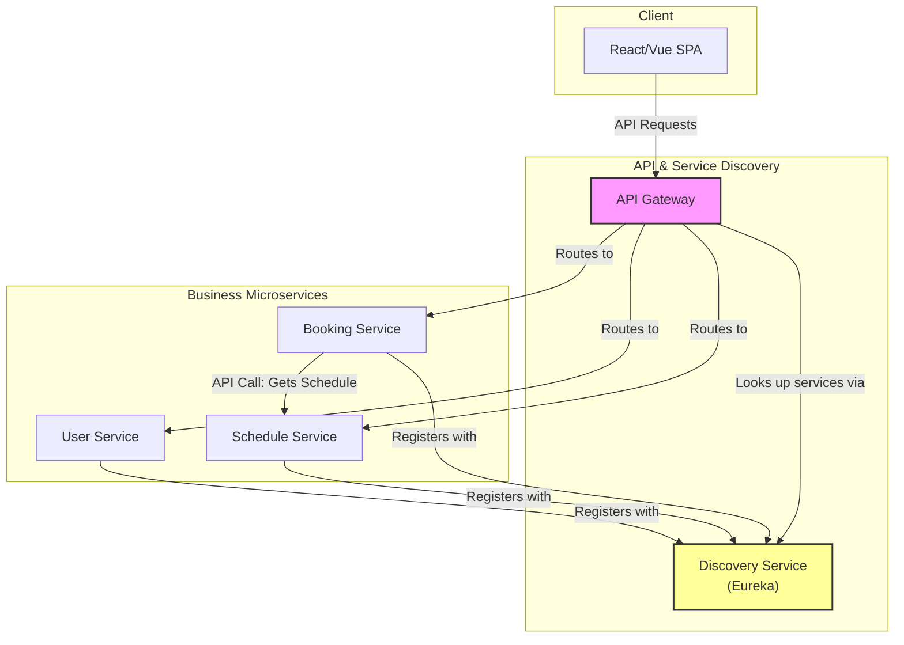
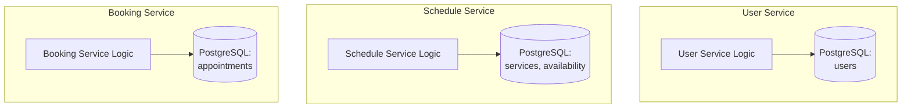
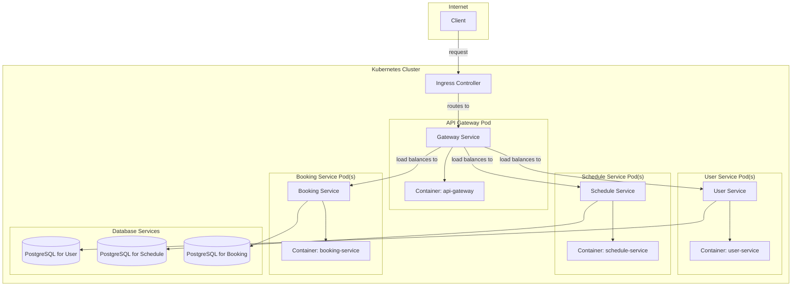

# Java Microservices Architecture

This document outlines the planned architecture for the Java-based microservices version of the Unified Appointment Scheduler.

## 1. High-Level Component Diagram

This diagram shows the core services and the flow of communication from the client to the individual services through an API Gateway.

**Flow Description:**
1.  The **Frontend** is a Single-Page Application (SPA) that runs in the client's browser.
2.  All API requests from the frontend are sent to a single entry point: the **API Gateway**.
3.  The **API Gateway** is responsible for routing requests to the appropriate downstream microservice. It finds the network location of these services by querying the **Discovery Service**.
4.  Each microservice (**User**, **Schedule**, **Booking**) handles a specific business domain. They register themselves with the Discovery Service on startup.
5.  Services can communicate with each other via API calls if necessary (e.g., the Booking Service needs to get availability data from the Schedule Service).

---

## 2. Database-per-Service Schema

A core principle of this architecture is that each microservice owns its own data and has its own dedicated database. This prevents tight coupling between services.

**Data Ownership:**
*   **User Service:** Owns the `users` table. All other services must go through the User Service's API to get user information.
*   **Schedule Service:** Owns the `services` and `availability` tables.
*   **Booking Service:** Owns the `appointments` table.

---

## 3. Deployment Architecture (Docker & Kubernetes)

This diagram illustrates how the containerized services will be deployed and managed within a Kubernetes cluster.

**Deployment Flow:**
1.  Each Java microservice is packaged as a **Docker Image**.
2.  These images are stored in a container repository (like Docker Hub or Amazon ECR).
3.  In Kubernetes, we define **Deployments** for each service, which manage creating and scaling **Pods**. Each Pod runs a container with our service's image.
4.  We create a Kubernetes **Service** for each microservice, which provides a stable network address and load balancing for the Pods.
5.  An **Ingress Controller** acts as the entry point to the cluster, routing external traffic to the API Gateway's service, which then routes internally to the other services.

---

## 4. Monolithic vs. Microservices Architecture

This section highlights the core differences and trade-offs between the PHP Monolithic architecture we built and the Java Microservices architecture we are planning.

| Feature | Monolithic Architecture (Our PHP App) | Microservices Architecture (Our Java Plan) |
| :--- | :--- | :--- |
| **Structure** | Single, unified codebase and executable. | Collection of small, independent services. |
| **Deployment** | The entire application is deployed as one unit. | Each service can be deployed independently. |
| **Scalability** | Must scale the entire application, even if only one feature is under heavy load. | Can scale individual services based on their specific needs. |
| **Technology Stack** | Locked into a single stack (PHP, Apache, SQLite). | Each service can use the best technology for its task (e.g., different databases, languages). |
| **Fault Isolation** | An error in one module can bring down the entire application. | An error in one service is isolated and typically won't crash other services. |
| **Development** | Simpler to start and develop initially. Becomes complex as the application grows. | More complex to set up initially. Easier to manage and develop for large, complex applications. |
| **Database** | Single, shared database for the entire application. | Each service has its own private database. |

### Advantages of Migrating to Microservices

1.  **Improved Scalability:** We can scale the `Booking Service` independently if we get a lot of traffic, without needing to scale the `User Service`.
2.  **Technology Flexibility:** We could write a new, high-performance notification service in a different language like Go or Python if we wanted to, without changing the existing services.
3.  **Increased Resilience:** If the `Schedule Service` has a bug and crashes, users can still log in and view existing appointments because the `User Service` and `Booking Service` are still running.
4.  **Easier Maintenance:** Smaller, focused teams can work on individual services without needing to understand the entire system, leading to faster development cycles.

### Disadvantages and Challenges of Microservices

1.  **Operational Complexity:** We need to manage the deployment, monitoring, and networking for many small services instead of just one application. Tools like Kubernetes are essential but have a steep learning curve.
2.  **Distributed System Challenges:** We have to deal with network latency, service discovery, and ensuring data consistency across different databases, which are complex problems.
3.  **Higher Initial Overhead:** Setting up the CI/CD pipelines, monitoring, and infrastructure for a microservices architecture is more work upfront than just deploying a single application.
4.  **End-to-End Testing is More Difficult:** Testing a business process that spans multiple services requires a more sophisticated testing strategy.
