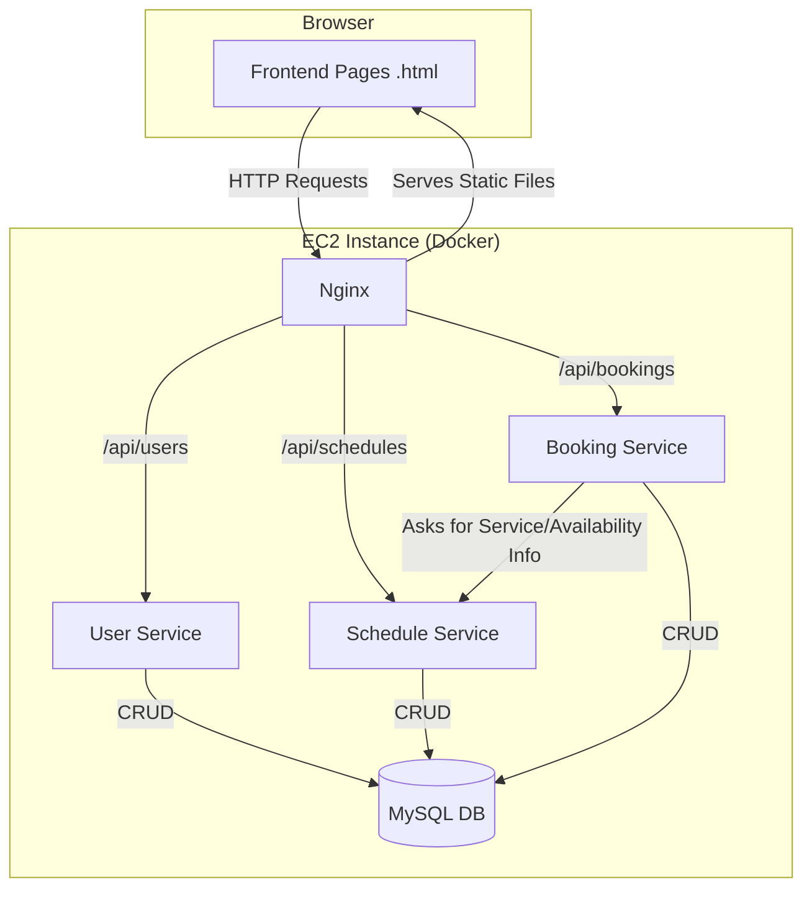

# Architecture & API Flow Guide

This document provides an overview of the Java Appointment Scheduler application, its components, and the flow of data through its microservices.

## 1. Component Overview

The application is built on a microservices architecture, containerized with Docker, and designed to run on an AWS EC2 instance.

### Backend Technologies
- **Java 17**: The core programming language for all microservices.
- **Spring Boot**: The framework used to build the three backend microservices.
  - **Spring Web**: For creating REST APIs.
  - **Spring Data JPA**: For communicating with the database.
  - **Spring Security**: For securing backend services (though currently configured to permit all traffic).
- **Maven**: For managing project dependencies and building the applications.

### Frontend Technologies
- **HTML5**: The structure for all user-facing pages.
- **CSS3**: For styling the user interface.
- **Vanilla JavaScript**: For all client-side logic, including API calls and dynamic page updates.

### Database
- **MySQL 8.0**: A relational database used to store all application data. The data is logically separated into three schemas (`user_db`, `schedule_db`, `booking_db`), one for each service.

### Infrastructure & Deployment
- **Docker**: Used to containerize each of the three microservices, the MySQL database, and the Nginx web server.
- **Docker Compose**: Used to define, orchestrate, and run the multi-container application with a single command.
- **Nginx**: Acts as a reverse proxy and web server. It serves the static frontend files (HTML, CSS, JS) and forwards API requests to the appropriate backend microservice.
- **AWS EC2**: The cloud server where the entire Dockerized application is deployed and runs.

---

## 2. Application & API Flow

The application is split into three distinct microservices, each with its own responsibilities and database schema.

### Flow 1: Provider Onboarding

This flow describes how a service provider sets up their profile.

1.  **Provider Registration (`index.html`)**
    -   **Action**: A provider fills out the registration form and submits.
    -   **API Call**: `POST /api/users/register`
    -   **Service**: `user-service`
    -   **Logic**: Hashes the provider's password and saves the new user record to the `users` table in `user_db`.

2.  **Provider Login (`login.html`)**
    -   **Action**: A provider enters their credentials to log in.
    -   **API Call**: `POST /api/users/login`
    -   **Service**: `user-service`
    -   **Logic**: Verifies the credentials against the `users` table. On success, it returns the user's details. The frontend stores these details in the browser's Local Storage to manage the session.

3.  **Provider Manages Services (`services.html`)**
    -   **Action**: The provider adds or edits the services they offer.
    -   **API Call**: `POST /api/schedules/services`
    -   **Service**: `schedule-service`
    -   **Logic**: Saves the service details (name, duration) to the `services` table in `schedule_db`.

4.  **Provider Sets Availability (`availability.html`)**
    -   **Action**: The provider defines their weekly working hours.
    -   **API Call**: `POST /api/schedules/availability`
    -   **Service**: `schedule-service`
    -   **Logic**: Saves the availability rules (day of the week, start/end time) to the `availability` table in `schedule_db`.

### Flow 2: Client Booking an Appointment

This flow describes how a client books an appointment with a provider.

1.  **Client Views Booking Page (`booking.html`)**
    -   **Action**: The client navigates to the provider's public booking page.
    -   **API Call**: `GET /api/schedules/services/provider/{providerId}`
    -   **Service**: `schedule-service`
    -   **Logic**: The page fetches and displays all services offered by that provider.

2.  **Client Selects Date to See Availability**
    -   **Action**: The client chooses a service and a date.
    -   **API Call**: `GET /api/bookings/availability/{providerId}?serviceId=...&date=...`
    -   **Service**: `booking-service`
    -   **Logic (Cross-Service Communication)**:
        1.  The `booking-service` receives the request.
        2.  It first calls the `schedule-service` to get the duration of the selected service.
        3.  It then calls the `schedule-service` again to get the provider's general availability for that day of the week.
        4.  It queries its own `booking_db` to find any appointments that are already booked for that day.
        5.  Finally, it calculates the remaining open slots and returns them to the frontend.

3.  **Client Confirms the Booking**
    -   **Action**: The client selects an available time slot, fills in their name and email, and clicks "Confirm Appointment".
    -   **API Call**: `POST /api/bookings`
    -   **Service**: `booking-service`
    -   **Logic**:
        1.  The `booking-service` receives the new appointment data.
        2.  It calls the `schedule-service` one last time to get the service duration.
        3.  It calculates the appointment's `endTime`.
        4.  It saves the complete appointment record to the `appointments` table in `booking_db`. (Note: The `userId` is currently hardcoded to `1` as a placeholder).

### Flow 3: Provider Viewing Appointments

1.  **Provider Navigates to Appointments Page (`appointments.html`)**
    -   **Action**: The provider clicks the "Go to Appointments" link on their dashboard.
    -   **API Call**: `GET /api/bookings/provider/{providerId}`
    -   **Service**: `booking-service`
    -   **Logic**: Fetches all appointments associated with that provider from the `appointments` table and returns them to the frontend to be displayed in a table.
